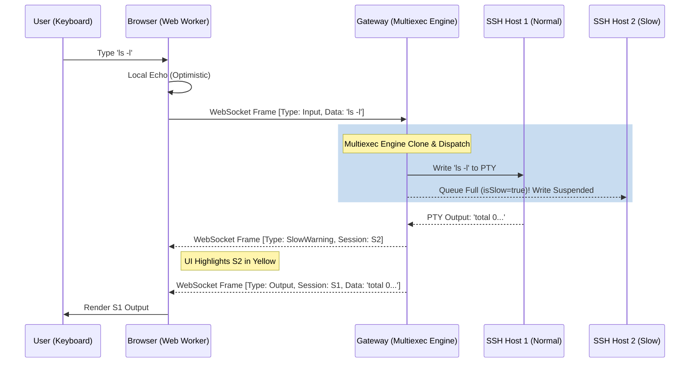

# 执行与编排协议

本协议旨在规范批量命令执行（Multiexec）引擎的内部流转逻辑，以及多主机输出差异对比机制，确保在大规模并发场景下命令的一致性与界面的稳定性。

## 1. Multiexec（输入广播）机制

### 1.1 执行模型角色
在多选主机的情况下，输入广播由以下角色构成：
- **`activeSession`**: 当前聚焦的输入源终端，负责捕获用户真实的键盘输入交互。
- **`selectedSessions`**: 选定的目标执行集群。所有在 `activeSession` 中产生的合法输入数据都将被克隆并广播至这些 session 中。

### 1.2 写入机制与保序原则
- **独立消息队列**: 网关为每个目标 Session 分配独立的写入队列。
- **异步非阻塞**: 输入的分发采用异步处理，绝不因为单个节点的网络波动阻塞整个广播链路。
- **严格 FIFO 保序**: 所有的按键字符、控制字符必须遵循严格的先入先出规则发送，防止命令错乱（如 `rm -rf` 变成不可逆的灾难指令）。

### 1.3 慢节点熔断处理
当某些老旧目标机或网络不佳节点的缓冲区持续积压时：
1. 标记该节点内部状态为 `isSlow = true`。
2. 暂停将新广播指令送入该节点。
3. 触发 Gateway 向前端下发对应的 `SlowWarning` 控制帧。
4. UI 侧根据状态对该节点进行视觉标记（例如变黄），并且**隔离影响**：该慢节点的延迟不干扰其他正常节点的敏捷执行。

### 1.4 广播执行时序图 (Mermaid)

---

## 2. 差异识别 (Diff Engine) 与输出隔离

在集群批量执行命令后，为了对数百台主机的反馈进行聚合、审计或者异常巡检，需要将输出数据进行隔离并提取特征指纹。

### 2.1 规范化清洗与比对流水线
对每一个 Session 的 `Raw Output` 数据，严格按照以下次序执行数据管道：
1. **ANSI Strip (除色除控)**: 正则替换并去除所有的颜色代码、光标移动指令、清屏等富文本控制字符，提取纯文本。
2. **Regex Filter (降噪过滤)**: 基于系统设定或用户规则，过滤掉类似于时钟、动态进度条等无用的噪音数据。
3. **行切分 (Split)**: 按照回车符 `\n` 将洗净的字符串切割为多行数组。
4. **哈希计算 (Hash)**: 对结果进行快速的 MD5 或 SHA1 哈希计算，生成这段内容的特征码。
5. **对比聚合 (Compare)**: 将各个主机的哈希值与返回的 **Exit Code** 综合作为比对依据，以判断多台机器执行状态的同质性。

---

## 3. 上下文状态一致性探测

为避免向处在 `vim/top` 等全屏程序的主机发送 bash 脚本导致异常，需要探测主机的 Shell 环境状态。

### 3.1 探测手法与识别
- **探测包**: 隐蔽发送控制符 `\x05` (ENQ) 或者是无害的回车 `\n` 探针。
- **状态分析**:
  - `shell`: 输出中包含明显的命令提示符（Prompt，如 `$` 或 `#`）。
  - `tui`: 检测到全屏控制指令或者 ANSI 定位符。
  - `unknown`: 规定时间内无任何输出反馈。
- **系统行为防错**: 对判定为 `tui` 或 `unknown` 的 Session，UI 将施加**红色警告遮罩**，默认从 Multiexec 广播组中排除，且临时禁止输入。

---

## 4. 前端回显竞争解决方案

**痛点**: 当多节点组同时返回回显字符时，极易引起 active 终端渲染时的字符跳动或重影闪烁。

**必须实现的解决方案 - 乐观回显与锁定机制**:
1. 采取**前端本地“乐观回显”**: 当用户在 activeSession 敲击键盘时，该终端立即本地显示对应输入字符，不等待服务端确认。
2. **全局锁定**: 在发起广播瞬间，临时锁定所有 Multiexec 终端（terminal）的远端回显渲染通道。
3. **统一刷新**: 设定一个短时间缓冲窗口，等待服务器将各节点的处理反馈收集完毕后，再一次性释放缓冲并在 UI 上统一刷新，确保多视图视觉整齐划一。
*(或者简单地在极短的时间窗口内，强制统一禁用远端来的回显包)*
