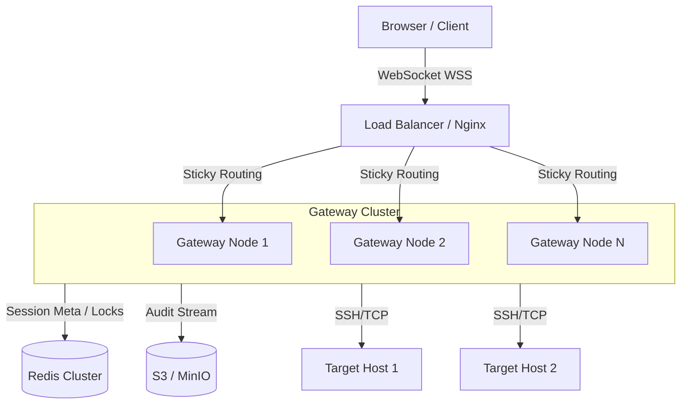
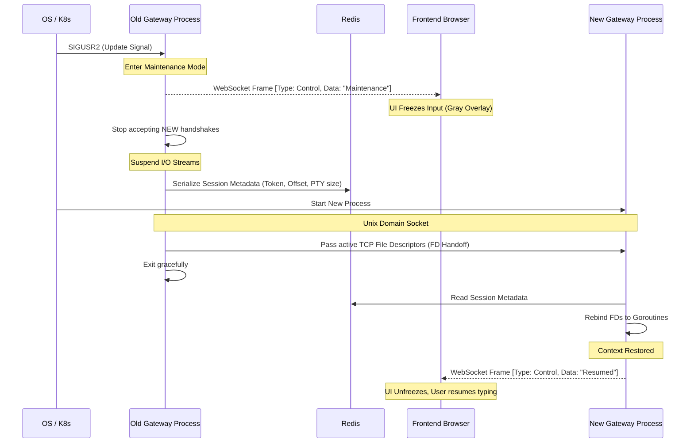

# 部署与运行时架构

为了保障高可用、支持平滑升级以及水平扩容，本平台在部署设计上采用“无状态路由 + 有状态节点 + 集中式存储”的架构模式。

## 1. 部署拓扑图

## 2. 运行时机制设计

### 2.1 高可用与“有状态”的平衡
虽然 WebSocket 和 SSH 都是典型的长连接（有状态），但为了支持 Gateway 节点的随时扩缩容，我们通过以下设计来平衡：
- **粘性路由**: 负载均衡器基于用户的 SessionId 或特定的 Cookie，将该用户的所有请求路由到特定的 Gateway 物理节点。
- **元数据外置**: 当前连接节点的分配关系、Session 的状态信息写入 Redis。即使某个 Gateway 崩溃，UI 也知道该重连，且其他逻辑网关可以获取锁进行后续处理。

### 2.2 优雅重启 (Graceful Restart) - 核心特性
运维工具自身的发版绝不能轻易打断用户正在线上敲击的关键命令。
 Gateway 升级发布必须遵循以下优雅重启（热更新）流程：

1. **下达维护信号**: 系统收到 `SIGUSR2` 或 Kubernetes `PreStop` 钩子信号，进入维护模式。
2. **拒绝新连接**: 网关立刻停止在监听端口上接收任何新的 WebSocket 握手请求。
3. **通知前端冻结**: 通过下发特定的二进制帧（FrameType: Session Control），广播“维护中”字样，前端立即冻结用户键盘输入操作，但界面不关闭。
4. **元数据状态固化**: 挂起当前数据流，将所有现存的、活跃的 Session 元信息（包括当前的流读取 Offset、PTY 窗口大小、鉴权 Token）通过 JSON 序列化并瞬间写入 Redis。
5. **移交描述符 (FD Handoff)**: 利用底层 Socket 的特权，将那些未关闭的 TCP 文件描述符通过 Unix Domain Socket 移交给刚拉起的新版进程。
6. **老进程退出与新进程接管**: 老进程在确保 FD 移交完毕后干净退出。新拉起的进程根据从 Redis 读出的元数据和接过来的 Socket，瞬间恢复上下文环境，并下发恢复帧。
7. **前端解除冻结**: 前端收到恢复帧，解除输入冻结，用户**无感知地继续操作**。

### 2.3 会话恢复与断线重连 (Detached Recovery)
- **触发条件**: 用户的 4G 信号中断、电脑合盖休眠等导致前端 WS 异常断开。
- **保护策略**: 只要没有收到明确的 `close` 指令，后端的 SSH 不会随之销毁，而是转入 `detached` 状态。SSH keepalive 继续探测底层链路。
- **重连恢复**: 当用户网络恢复，重新发起带有特定 `sessionId` 与断点序号的连接。Gateway 校验通过后，将积压在 Buffer Pool 中的最近屏幕输出重新投递，xterm.js 接收后恢复原始的屏幕显示。
- **清理超时**: `detached` 会话自带 TTL 定时器，默认 10 分钟。到期未被领走，系统无情回收，释放服务器 FD。
